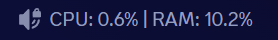
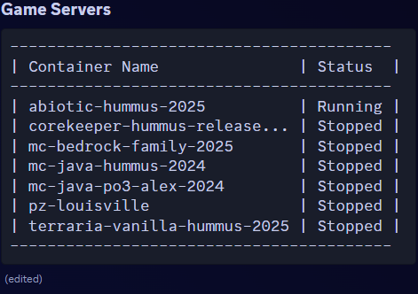

<h1 align="center">DD_Bot</h1>
<h1 align="center">This custom fork has added categories/sections based on container labels, as well as host system metrics reporting as a discord voice channel name.</h1>

<p align="center">A Discord-Bot to start and stop Docker Containers, using the Docker Socket</p>
<p align="center">
<a href="https://hub.docker.com/r/thisismynameok/docker-discord-bot">
</a>

</p>

`"Conveniently, the program itself can be used as a Docker Container"` - ***Gadget Gabe*** \
**NEW: Now with commands to adjust permissions** 

## NEW: Container Labels for Section Outputs

- Add a label to your docker container via the labels instruction

    ```yml
    {
    container:
        image: ...
        ...
        labels:
            section: "Game Servers"

    container2:
        image: ...
        ...
        labels:
            section: "Frontend"
    }
- Add a new section in settings.json's "DiscordSettings" to set this order based on labels

    ```json
    {
    "DiscordSettings": {
        "Token": "",
        "AdminIDs": [],
        "UserWhitelist": true,
        "UserIDs": [],
        "UsersCanStopContainers": true,
        "AllowedContainers": [],
        "RoleStartPermissions": {},
        "RoleStopPermissions": {},
        "UserStartPermissions": {},
        "UserStopPermissions": {},
        "SectionOrder": [
            "Game Servers",
            "Frontend"
        ]
    }
    }
- Output of /list will now separate into separate tables based on these labels and ordering


## NEW: Host System Metrics Reporting via Discord Voice Channel Name

- Mount the host's /proc as ro to the docker container, as well as pass 3 new environment variables for the bot to connect to the desired discord, and update the desired channel

    ```yml
    docker-discord:
        image: thisismynameok/docker-discord-bot
        container_name: docker-discord
        volumes:
            - $DOCKERDIR/appdata/docker-discord/settings:/app/settings/:rw
            - /var/run/docker.sock:/var/run/docker.sock
            - /proc:/host_proc:ro # <--- New Mount for EnableMetrics=true --->
        environment:
            TZ: $TZ
            PUID: $PUID
            PGID: $PGID
            DISCORD_TOKEN: $DISCORD_TOKEN # <--- New Env Var for EnableMetrics=true --->
            GUILD_ID: $DISCORD_GUILD_ID # <--- New Env Var for EnableMetrics=true --->
            CHANNEL_ID: $DISCORD_CHANNEL_ID # <--- New Env Var for EnableMetrics=true --->
        restart: always
- Add a new section in settings.json's "DiscordSettings" to enable these metrics - false by default. If set to true, you need the above new mount, and 3 new env vars.

    ```json
    {
    "DiscordSettings": {
        ...
        "SectionOrder": [
            "Game Servers",
            "Frontend"
        ],
        "EnableMetrics": false
    }
    }
- EnableMetrics=true will update the desired discord voice channel name every 11 minutes with host CPU & Memory usage info

> 

## NEW: Assign Container Control Permissions Based on Section/Label

- Instead of having to assign individual container permissions to a role, you can now assign it a "section" to be able to control.
    
    ```json
    {
        "DiscordSettings": {
            ...
            "RoleStartPermissions": {
                "######": [
                    "Game Servers"
                ]
            },
            "RoleStopPermissions": {
                "######": [
                    "Game Servers"
                ]
            },
            "UserStartPermissions": {},
            "UserStopPermissions": {},
            "SectionOrder": [
                "Game Servers",
                "Frontend",
                "Backend"
            ],
            "EnableMetrics": false
        }
    }

- This will print out only the container section/category assigned to the role.


## Screenshots


## Features

- Remotely start and stop Docker Containers using Discord Slash Commands
- Easily grant Users and Groups on your Discord access to selected containers
- Enable Friends to start specified Containers, e.g. Gameservers
    - Save Energy when noone is playing
- DD_Bot is designed to work on the same machine in its own Container
- Easy configuration through a single json file
- Built using [Discord.NET](https://github.com/discord-net/Discord.Net) and [Docker.DotNet](https://github.com/dotnet/Docker.DotNet)

## Requirements

- Docker
- a correctly configured bot from [Discord Developer Portal](https://discord.com/developers/), instructions can be found [here](/sites/discordbot.md)
- Internet connection

## [Installation](/sites/installation.md)

## [Settings](/sites/settings.md)

## [Commands](/sites/commands.md)

## [FAQ/Troubleshooting](/sites/faq.md)

## To-Do List

- [x] Initial release
- [x] Rewrite for docker sockets
- [x] Auto-updates for the settings.json Files
- [x] Commands to grant and revoke privileges to users and groups
- [ ] Fully customizable messages for Discord
- [ ] More statistics
- [ ] \(Maybe\) Auto-Shutdown for certain containers
- [ ] \(Maybe\) more command options
- [ ] \(Maybe\) implement RCON to control gameservers


### If you like my work, feel free to buy me a coffee
<p>
<br><a href="https://www.buymeacoffee.com/assaro"> </a></p><br>

## License

This project is licensed under the GNU General Public License v3.0. See the [LICENSE](LICENSE) file for more details.

## Attribution

This project is a fork of the original repository by https://github.com/Assaro/DD_Bot. Significant modifications have been made by https://github.com/thisismygithubok/DD_Bot on 1 Feb 2025. Changes include: Added categories/sections based on container labels.

